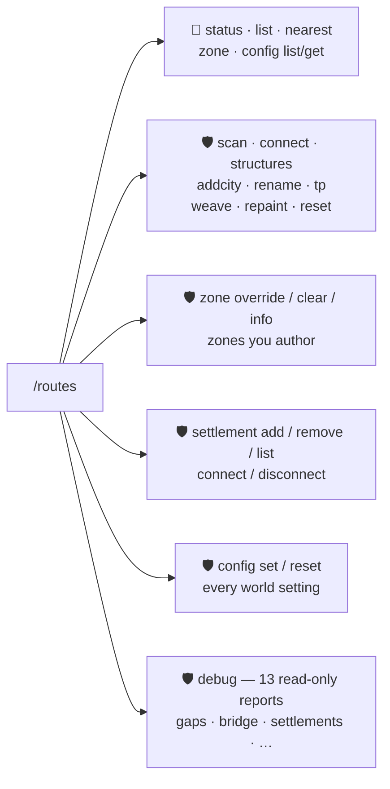

# ⌨️ Commands

The complete manual for every **`/routes`** command — the road network.

👤 = every player · 🛡️ = operator (permission level 2)

## Quick reference

| Command | Who | One-liner |
| --- | :---: | --- |
| `/routes status` | 👤 | Network summary: towns, nodes, completed routes, queued edges. |
| `/routes list [cities\|routes]` | 👤 | Every known town / completed route, with coordinates. |
| `/routes nearest` | 👤 | Closest town and route, with distance and heading. |
| `/routes zone` | 👤 | What the chunk you stand in is painted as. |
| `/routes scan [radius]` | 🛡️ | Scan loaded chunks for city structures (1–100 chunks). |
| `/routes connect` | 🛡️ | Queue a road between the two nearest cities. |
| `/routes structures` | 🛡️ | Dump the structure-registry match report. |
| `/routes addcity [name]` | 🛡️ | Register where you stand as a named city. |
| `/routes rename <name>` | 🛡️ | Rename the nearest town. |
| `/routes tp <town>` | 🛡️ | Teleport to a named town. |
| `/routes weave [loops]` | 🛡️ | Force ring roads now (1–16). |
| `/routes repaint` | 🛡️ | Re-broadcast the map paint to everyone online. |
| `/routes reset` | 🛡️ | Wipe the roads and re-queue every connection. |
| `/routes zone override <kind> [force]` | 🛡️ | Declare this chunk a different kind, and keep it that way. |
| `/routes zone clear [force]` | 🛡️ | Hand this chunk back to the generated map. |
| `/routes zone info` | 🛡️ | What the world generated here vs. what the override says. |
| `/routes zone create <kind> <from> <to> [name]` | 🛡️ | Author a whole box as a named zone. |
| `/routes zone expand\|reduce <name> <from> <to>` | 🛡️ | Grow or shrink it by a box. |
| `/routes zone delete\|rename <name> …` | 🛡️ | Remove it, or rename it. |
| `/routes zone list` | 🛡️ | Every authored zone: kind, chunks, author. |
| **Laburo** (item) | 🛡️ | The same zone authoring, by clicking two corners. No recipe — creative only. |
| `/routes settlement …` | 🛡️ | Your own towns and connections in the gen2 graph. |
| `/routes config …` | 👤/🛡️ | Read and change this world's settings from in game. |
| `/routes debug …` | 🛡️ | Thirteen read-only reports, for pasting into a bug report. |

---

## 🛤️ `/routes` — the road network

### `status` — 👤
Prints the network at a glance: how many **towns** are known (and how many have real names), how
many **route nodes** were discovered, how many **routes are completed**, and how many **candidate
edges** wait in the build queue — then the first 16 routes with their endpoints.

### `list [cities|routes]` — 👤
The full inventory. `cities` lists every known town — its name (or *(unnamed town)*) and its `x, z`
coordinates; `routes` lists every completed route with its two endpoints. With no argument you get
both. Long lists are capped at 24 lines with an *"… and N more"* trailer.

### `nearest` — 👤
Where's civilization? Reports the **closest town** and the **closest route** to where you stand,
each with the distance in blocks and a compass heading (N, NE, E, …). Great when you're lost in
open wilderness.

### `scan [radiusChunks]` — 🛡️
Scans the **already-loaded** chunks around you (default 8, up to **100** chunks radius) and
registers any city structures it finds as route nodes. Use after exploring somewhere new when you
don't want to wait for the automatic discovery.

### `connect` — 🛡️
Locates the nearest connectable cities from your position (seed-based — no chunk loading) and
queues a road between them. The road then builds incrementally.

### `structures` — 🛡️
Prints the structure-registry match report: which structure tags/ids from **Cities include** exist
in this world and what matched. The first stop when a structure type isn't being connected.

### `addcity [name]` — 🛡️
Registers **where you are standing** as a city node (default name `Gym`) and queues its road
connections. The escape hatch for places without a structure tag — player builds, modded
structures, anything.

### `rename <name>` — 🛡️
Renames the **nearest town within 160 blocks**. The new name shows in arrival banners and route
endpoints; existing map waypoints refresh on rejoin.

### `tp <town>` — 🛡️
Teleports you to a **named** town (tab-completion suggests every real name), landing on a safe, dry
column — the same spot-finder that places a new world's spawn. Wrong name? It points you at
`/routes list cities`.

### `weave [loops]` — 🛡️
Runs the **ring-road pass right now**: up to `loops` (default 4, max 16) direct connections are
queued between towns that are close on the map but far apart by road. Every loop that completes
**encloses a new named AREA** — this is the fastest way to fill your map with them.

### `repaint` — 🛡️
Re-broadcasts the chunk-paint geometry to every online player, forcing the Xaero overlays to
refresh without relogging.

### `reset` — 🛡️
⚠️ Wipes the **road records** and re-queues every connection from the known cities. Already-paved
blocks stay in the world; the network rebuilds its bookkeeping from scratch.

---

## 🗺️ `zone` — what the ground under you is

### `zone` — 👤
The map-paint (and capture-zone) debugger: tells you what the **chunk you are standing in** is
painted as — a **CITY** (with its name), a **ROUTE** (name and endpoints), an enclosed **AREA**
(its `A#-Name`, or *unnamed until first entered*), or **open wilderness** (unpainted until your
network encloses it). Always agrees with the map colours and the zone pop-ups.

### `zone override <kind> [force]` — 🛡️
Declares the chunk you are standing in to be a **different kind**, and keeps it that way. The kinds
are the ones the map paints: `city`, `route`, `area`, `wilderness`. The map, the pop-ups and
`/routes zone` all follow the override from then on.

Overrides are a **second layer** over the generated map, not an edit of it: the underlying paint is
untouched, so a chunk you clear falls back to whatever the world generated. Tab-completion offers the
valid kinds.

`force` overrides a chunk that already carries one.

### `zone clear [force]` — 🛡️
Removes the override on this chunk, handing it back to the generated map. `force` clears one you did
not author.

### `zone info` — 🛡️
Prints both answers side by side for this chunk: what the world generated, and what the override says.
The first stop when the map and `/routes zone` disagree with each other.

### `zone create <kind> <from> <to> [name] [force]` — 🛡️
Authors **every chunk of a box** as one kind, under a name you can manage it by afterwards. The two
corners are ordinary coordinates and accept `~ ~`, so the usual way to draw one is to stand at a
corner and type `~ ~`, walk to the opposite corner, and type `~ ~` again.

Leave the name out and it gets a generic one — `Z1`, `Z2`, … — which you can change later with
`zone rename`.

The box is capped at **1024 chunks** (32 × 32). A box over the cap does **nothing at all** rather
than half of it; build bigger zones in pieces with `zone expand`.

### `zone expand <name> <from> <to> [force]` — 🛡️
Adds a box to a zone that already exists. The kind comes from the zone itself, not from you — a zone
with two kinds in it would not be one zone.

### `zone reduce <name> <from> <to>` — 🛡️
Takes a box back out of that zone. Only chunks of **that** zone are touched, so a box that overspills
onto a neighbour leaves the neighbour alone — which is why this one needs no `force`.

### `zone delete <name> [force]` — 🛡️
Hands every chunk of the zone back to the generator. `force` is needed only for chunks somebody else
authored.

### `zone rename <name> <newName>` — 🛡️
Renames it. Nothing moves between zones, so nothing on the map changes.

### `zone list` — 🛡️
Every authored zone: name, kind, how many chunks, and who authored it. Also counts the one-off
overrides from `zone override`, which belong to no zone.

!!! warning "Authoring a zone does not build anything"
    These commands decide what ground **counts as** — for the map, for the zone pop-ups, and for the
    capture zones of [Cobblemon Nuzlocke & Soul Link](../nuzlocke/index.md). They do not put a road
    in the ground: roads are drawn as terrain generates, so authoring a route across country you have
    already explored gives you a route on the map with no road under it.

!!! danger "Reassignment is refused on purpose"
    A chunk that already belongs to something is **refused**, and the report names what it would have
    taken. That is not caution for its own sake: a chunk's zone **is** the capture zone, so moving one
    from one zone to another can retroactively change whether a catch already made there was legal.
    `force` goes through anyway, and the report tells you exactly what it overwrote.

---

## 🔴 The Laburo — the same thing, by hand

A red-bladed shovel for map makers. It does the same write the commands above do, but you point at the
corners instead of typing them.

**It has no recipe.** Take it from the **Tools** tab of the creative inventory, or `/give` it. It does
nothing at all without operator permission, so a crafting recipe would only put it in a survival
player's hands and teach them it is broken.

| Do this | And it |
| --- | --- |
| **Right-click a block** | sets one corner — then the opposite corner, which creates the zone |
| **Sneak + right-click** | changes what the next zone will be: **town** → **road** → **nothing** |
| **Right-click the air** | tells you the mode, and forgets a corner you left pending |

The new zone gets a generic name (`Z1`, `Z2`, …) — rename it with
`/routes zone rename <name> <newName>`.

!!! note "Why there is no *area* mode"
    An area is not something you paint. It is the enclosed space the mod finds **between** the painted
    chunks, so the way to make one is to author the roads that enclose it.

!!! tip "The tool never forces"
    Where the box crosses ground that already belongs to something, those chunks are left alone and
    the tool names what stood in the way. There is no gesture for overriding that on purpose —
    `/routes zone expand <name> <from> <to> force` is, and it stays typed.

---

## 🟩 Areas close themselves

You never draw an area. An area is the space left **between** the roads, so the way to make one is to
enclose it — and the moment an authoring edit closes a pocket, that pocket is named and marked, and
whatever you used to close it tells you how many appeared.

That works the same whether you closed the ring with `/routes zone create`, with `expand`, or with the
Laburo. Areas that close the ordinary way, as the world generates its own roads, are unchanged.

A pocket has to be a reasonable size to count: too small and it is a road curving back on itself, too
large and it is simply open country.

!!! warning "An area is not un-named if you open it again"
    Take away the roads that enclosed an area and the ground opens up, but the area keeps its name and
    its marker. That is deliberate and it is the same rule every other record here follows: it is the
    register of what somebody has already seen, and in a
    [Nuzlocke](../nuzlocke/index.md) world catches are counted against it. Quietly retiring one would
    move a capture zone out from under a catch already made.

---

## 🏘️ `settlement` — your own towns and connections

A separate subtree from `addcity` and `connect`, and the distinction matters: those two feed the
classic route network, while these feed **gen2's settlement graph** — the one that draws roads during
worldgen. The two are not the same network.

Declared settlements and connections are remembered with the world and survive a restart.

### `settlement add [name]` — 🛡️
Registers **where you are standing** as a settlement in the gen2 graph, optionally named. Roads plan
to it as if the world had generated a town there.

### `settlement remove` — 🛡️
Removes the declared settlement nearest to you. Only your own: a settlement the world generated is not
yours to delete.

### `settlement list` — 🛡️
Every settlement and connection you have declared in this world, with coordinates.

### `settlement connect <x> <z>` — 🛡️
Declares a road between the settlement nearest to you and the one nearest to `x, z`. A declared
connection is the one edge nothing is allowed to re-route: it exists because you said those two places
are joined.

### `settlement disconnect <x> <z>` — 🛡️
Removes that declaration. The two places may still end up connected by the ordinary rules — this only
withdraws your instruction.

---

## ⚙️ `config` — read and change this world's settings

The whole tree is generated from the same option catalog the world-creation tabs are built from, so
every setting on the **ROUTES** tab is reachable here under the same name, and neither surface can
drift from the other. See [World Creation & Config](configuration.md) for what each one does.

A change is written **twice**: onto the settings the game is reading right now, and into the rules
stored with the world — so it takes effect immediately *and* survives the next load.

### `config list` — 👤
Every option and its current value, grouped under the same six headings the ROUTES tab uses.

### `config get <option>` — 👤
One option and its current value.

### `config set <option> <value>` — 🛡️
Changes it. The value is typed: a number option only accepts a number **within its own limits**, a
toggle only accepts true/false, and an option with a fixed set of choices tab-completes them. A list
option is typed as `a, b, c`.

### `config reset <option>` — 🛡️
Back to the mod's own default for that option.

!!! warning "Some settings only affect ground that has not generated yet"
    Anything about the shape of the road network — how many roads leave a town, how long they may be,
    how steep, how wide — decides what gets **built**. Changing it does not rebuild what is already
    there. See the note on each option in [Configuration](configuration.md).

---

## 🔬 `debug` — measure it instead of guessing

Operator tooling, and it prints raw English rather than translated text: it exists to be pasted into a
bug report. Every one of these is **read-only** — none of them changes the world.

Most take a radius in chunks and default to something sensible, so `/routes debug gaps` on its own is
usually what you want.

| Command | Radius | What it reports |
| --- | :---: | --- |
| `debug structures` | — | which structure tags and ids from **Cities include** exist in this world, and what matched. The first stop when a structure type is not being connected |
| `debug towns [r]` | 8–512, def. 128 | every settlement the seed puts in range, as the road network sees them |
| `debug settlements [r]` | 8–256, def. 64 | the settlement graph with a **census**: how many roads each rule contributed, and how many were folded into shared trunks. The answer to "why does this world have so many roads" |
| `debug graph [r]` | 8–512, def. 128 | the graph's nodes and how they cluster |
| `debug edges [r]` | 8–512, def. 128 | every planned road in range, with its endpoints |
| `debug paint [r]` | 1–32, def. 8 | what the map layer thinks each chunk around you is |
| `debug areas [r]` | 1–48, def. 16 | the enclosed areas in range and what bounds them |
| `debug verify [r]` | 8–512, def. 128 | walks the roads in range and reports anything that does not add up |
| `debug gaps [r]` | 8–512, def. 128 | every place a road, a tunnel or a bridge hands over to the next, and the size of the step there. **Where a "the road has a hole in it" report starts** |
| `debug bridge [r]` | 8–512, def. 128 | walks each bridge span and reports cells with no deck, with coordinates |
| `debug spawn` | — | what the spawn finder decided for this world, and why |
| `debug bench [columns]` | 16–10000, def. 400 | times the road drawer over that many columns |
| `debug chunks [count] [away]` | 4–4096, def. 64 | times whole chunk generation, optionally `away` blocks from you so it measures cold ground |

!!! tip "What to paste into a report"
    For a road that looks wrong: `debug gaps` and, if a bridge is involved, `debug bridge`. For a
    town that should be connected and is not: `debug structures` and `debug settlements`. For
    anything slow: `debug chunks`.
