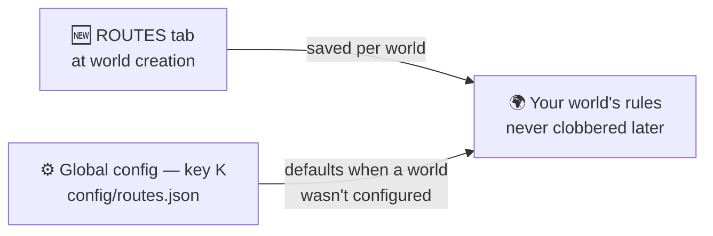

# 🧩 World Creation & Config

Everything is decided **when you create the world** — a dedicated **ROUTES** tab sits next to
**GAME / WORLD / MORE** on the create-world screen. Outside world creation there's a global config
screen for defaults.

!!! tip "Looking for the NUZLOCKE tab?"
    The Nuzlocke ruleset, its starter options and the Soul Link toggles belong to
    **[Cobblemon Nuzlocke & Soul Link](../nuzlocke/commands.md)** — install that add-on and its
    tab appears next to this one.

## ROUTES tab

The tab is split into six sections, in the order you meet them: what the network is, what it
connects, how a road is shaped, what it is made of, where you start, and what you are shown.

### Route Generation

| Option | Default | Notes |
| --- | --- | --- |
| Generate routes | on | master switch |
| Native route generation | on | roads are drawn as chunks generate — no walking needed. Off falls back to the classic generator that builds as you explore |
| Connect all structures | off | also connect surface structures that are not towns |
| Routes per city | 4 | a **ceiling**, not a count: each town rolls its own between 1 and this, so the network has hamlets and crossroads |
| Longest road | 1600 | the farthest two towns can be and still get a direct road |
| Ring roads | on | keep closing loops between nearby towns — loops are what enclose named **areas** |

### Towns & Settlements

| Option | Default | Notes |
| --- | --- | --- |
| Cities include | Villages + BCA Villages | 16-entry checklist: fossils, ruins, outposts, pyramids… |
| Settlement allowlist (advanced) | empty | exact structure ids that count as towns. Empty = the automatic rule |
| Never spawn here | RS ocean village | towns that may never be the world's **first** town. They stay ordinary towns otherwise |
| Confirm towns exist | on | check the jigsaw really assembles before the network treats a candidate as a town — no towns on the map with an empty field under them |

### Road Shape

| Option | Default | Notes |
| --- | --- | --- |
| Road width | 5 | odd numbers; the brush is symmetric around the centreline |
| Water crossing width | 10 | its own number, not a multiple of the road — open water reads much wider than it is |
| Road curviness | 5 | 0 = ruler-straight, 10 = maximum seeded wander |
| Steepest climb | 8 | tenths of a block per block, before a road cuts or bores instead of hugging the ground |
| Dig tunnels | on | off, a planned tunnel is built as a steep surface road over the top |
| Build bridges | on | off, a river becomes an open water lane and a dry gap is followed on the ground |
| Shape terrain around roads | on | the ground is road-shaped **before** anything is planted on it, instead of demolished afterwards. Decided once, when the world is created |
| Warm road chunks ahead | on | generate a road's chunks a little before you reach them, so the cost lands while you walk |

### Surface & Lighting

| Option | Default | Notes |
| --- | --- | --- |
| Road surface | Random (per route) | each route picks its own material, or fix one for every road |
| Road lamp posts | Random | Random / On / Off — Random decides per route |
| Tunnel lighting | Random | Random keeps some tunnels as dark caves |
| Underwater lighting | Random | sea lanterns along aquatic crossings |

### World Spawn

| Option | Default | Notes |
| --- | --- | --- |
| Spawn in city | on | move a new world's spawn into the nearest town; off leaves the vanilla wilderness spawn |
| Pregenerate around spawn | 1024 | chunks built in the background the first time you enter, so the map already shows towns and routes. 0 = off |

### Map & Notifications

| Option | Default | Notes |
| --- | --- | --- |
| Zone notifications | Toast | how entering a route or an area is announced: Off / Toast / Announcement / Chat |
| Xaero chunk paint | on | tint chunks on [Xaero's maps](map-integration.md) by category. Needs Xaero's Minimap; inert otherwise |

Who stands on the roads and what gets built beside the towns is the Nuzlocke add-on's: **road
trainers**, the **gyms next to towns** and the **league** are configured on its
[NUZLOCKE tab](../nuzlocke/commands.md). Routes on its own builds the towns and the roads
between them.

The map **tint intensity** and **colours** (City / Route / Area) are not world-creation choices —
adjust them live from the panel on [Xaero's world map](map-integration.md), where you can see what
you are changing.

!!! info "Saved per world"
    Choices made in these tabs are stored **per world** and only applied to a brand-new world —
    loading an existing world never gets its rules clobbered. Picking **Hardcore** at world
    creation auto-enables the full [Nuzlocke rule set](../nuzlocke/commands.md).

## Global defaults

The global defaults live in `config/routes.json` (English & Spanish labels) and are used
when a world wasn't configured through the tabs. The map-paint intensity also has live sliders on
[Xaero's world map](map-integration.md).

## Commands

The root is `/routes`; `/cobblemonroutes …` is accepted as an alias. The full manual — every
command, argument, permission and behaviour — lives on [the Commands page](commands.md).
