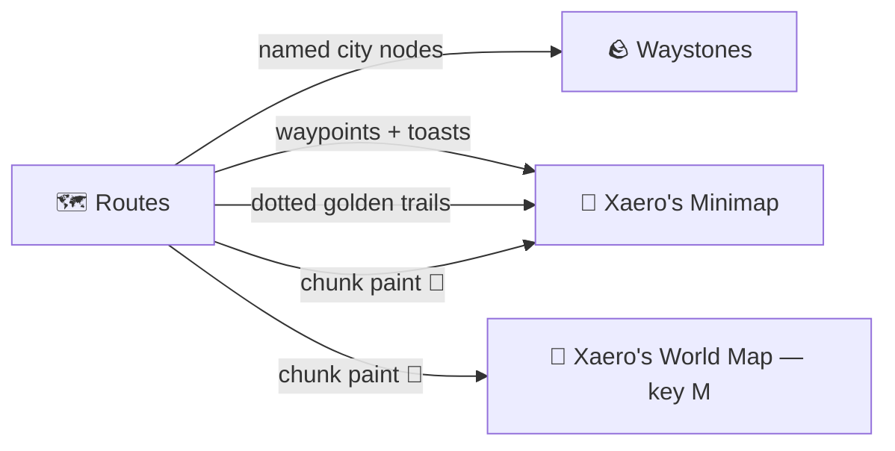

# 🧭 Map Integration

Routes talks to the maps you already use. Everything on this page is **optional** — the
mod detects what's installed and stays inert otherwise.

## Waystones

Activating a waystone registers it as a **named city** on the route network — your fast-travel
points become real places that roads connect to.

## Xaero's Minimap

- **Auto waypoints** — the first time you reach a **named town**, a **route** or an enclosed
  **area**, it drops a pin with a toast; every named waystone you activate does the same. Unnamed
  places are ignored, and a marker never doubles up — Xaero forgets runtime waypoints when you
  relog, so they are re-sent on join and de-duplicated on arrival. Whether they land in one set or
  three is the **waypoint grouping** choice on the world-map panel.
- **Chunk paint** 🎨 — the `xaero_chunk_paint` option (default on) tints chunks on the map by
  **category**, with a subtle low-opacity wash: **magenta** over cities/villages, **orange** over
  routes, and **teal** over an area once it is **fully enclosed** by your cities and routes — open
  wilderness stays unpainted until the network grows around it. Enclosed areas earn a name
  (**A1, A2, …** with a nature flavour, e.g. "A3-Frostpine") shown by their entry pop-up.

## Xaero's World Map

The chunk paint also renders on the **full-screen World Map (key M)** — visible independently of
the minimap's Cave Mode and of your Y level, on the surface and in caves alike. The world map also
carries this mod's **control panel** (top-left), which folds away behind its handle when the window
is small: a **Chunk paint** toggle for both maps, **three live intensity sliders** (City / Route /
Area) that re-tint the map in real time — 0 hides that category — a **colour picker** per category
that drives both the tint and the matching waypoint, the **waypoint grouping** choice, and a
**Load chunks** control that generates the ground around you so the map fills in without walking
it. See [how to test each of these](testing.md#7-xaeros-maps-paint-and-waypoints).

!!! note
    Get the map mods from [the Xaero's Minimap page](https://modrinth.com/mod/xaeros-minimap) and
    [the Waystones page](https://modrinth.com/mod/waystones) — then everything above just works.
